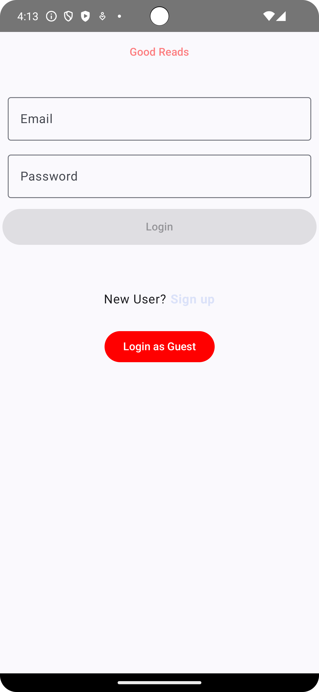
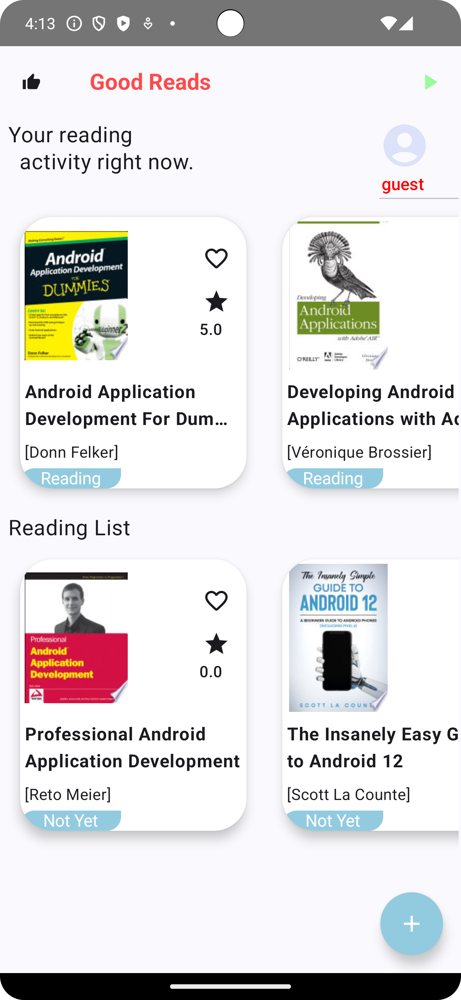
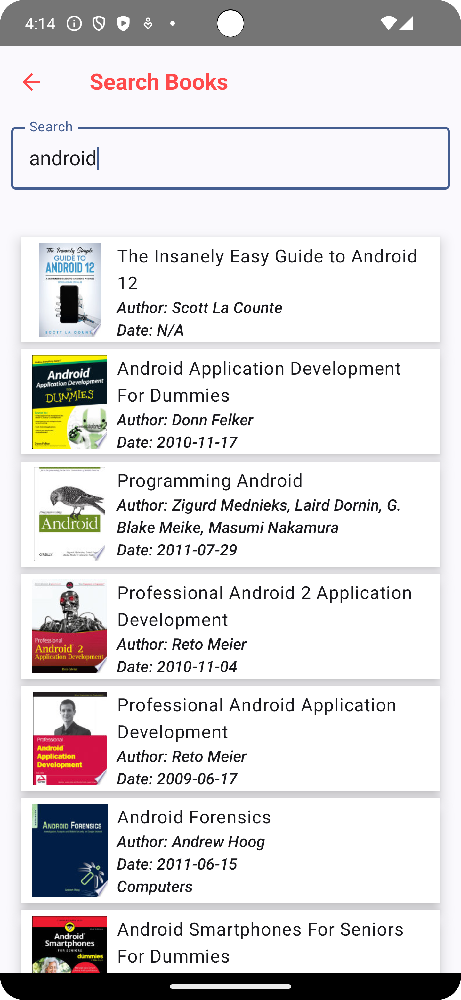
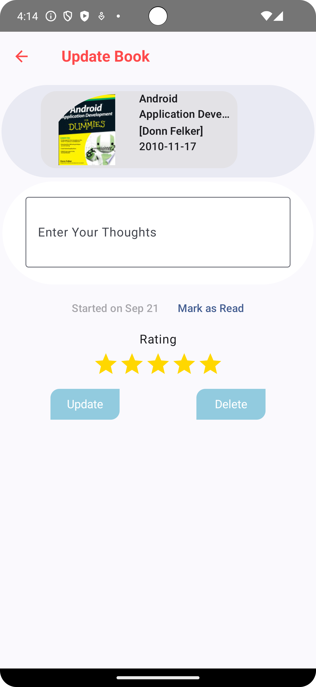
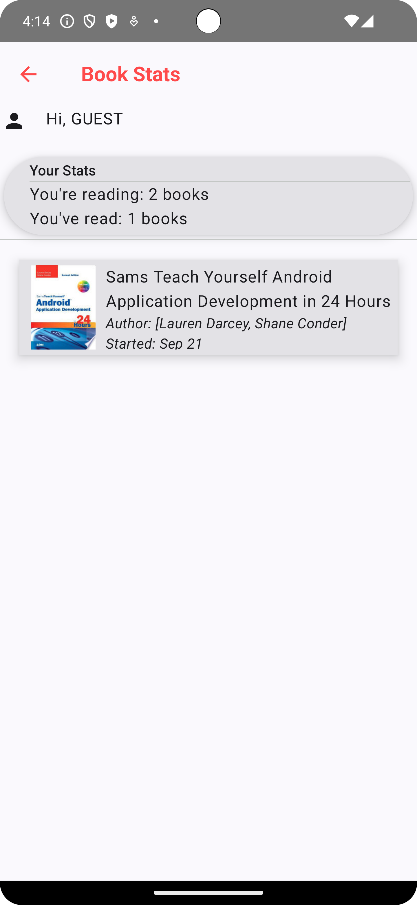

<p align="center">

<h1 align="center">📚 Good Reads - Book Tracking App 📚</h1>
<p align="center">
Discover and track your reading journey!
</p>
</p>

Good Reads is an app for book lovers to discover new books, track their reading progress, and maintain a personal library.


[](https://www.linkedin.com/in/timothysliu/)
[](mailto:timo9036@hotmail.com)

## Table of Contents

1. [Screenshots](#-screenshots)
2. [Features](#-features)
3. [Built With](#-built-with)
4. [Architecture](#️-architecture)
5. [Package Structure](#-package-structure)
6. [Installation](#️-installation)
7. [Contributing](#-contributing)
8. [License](#-license)

---

## 📸 Screenshots

Here's a glimpse of the Good Reads app in action!
<table>
  <tr>
     <th>Login Page</th>
     <th>Main Page</th>
     <th>Search Page</th>
  </tr>

  <tr>
    <td>
           
   </td>
   <td>
           
   </td>
   <td>
           
   </td>
  </tr>

 </table>

 <table>
  <tr>
    <th>Update Page</th>
    <th>Stats Page</th>
  </tr>

  <tr>
   <td>
           
   </td>
   <td>
           
   </td>
  </tr>

 </table>

## 🌟 Features

- **User Authentication:** Secure login and sign-up functionality using Firebase.
- **Explore Books:** Browse and search for books using the Google Books API.
- **Book Details:** View detailed information about each book.
- **Reading List:** Add books to your personal reading list.
- **Track Progress:** Update the status of your books to "Reading," "Read," or "Not Yet."
- **Rate Books:** Rate the books you have read.
- **Reading Stats:** Get insights into your reading habits.

## 🛠 Built With

<p align="center">
Explore the technology stack that powers Good Reads!
</p>

- [Kotlin](https://kotlinlang.org/) - The official programming language for Android development.
- [Coroutines](https://kotlinlang.org/docs/reference/coroutines-overview.html) - For asynchronous programming.
- [Jetpack Compose](https://developer.android.com/jetpack/compose) - Android’s modern toolkit for building native UI.
- [Android Architecture Components](https://developer.android.com/topic/libraries/architecture) - A collection of libraries for robust, testable, and maintainable apps.
  - [ViewModel](https://developer.android.com/topic/libraries/architecture/viewmodel) - Manages UI-related data in a lifecycle-conscious way.
  - [Navigation Component](https://developer.android.com/guide/navigation/navigation-getting-started) - For navigating between screens.
- [Dependency Injection](https://developer.android.com/training/dependency-injection)
  - [Hilt-Dagger](https://dagger.dev/hilt/) - For dependency injection.
- [Retrofit](https://square.github.io/retrofit/) - A type-safe HTTP client for Android.
- [Coil-kt](https://coil-kt.github.io/coil/) - An image loading library for Android backed by Kotlin Coroutines.
- [Firebase](https://firebase.google.com/)
    - **Authentication** - For user login and registration.
    - **Firestore** - As a cloud database to store user data and book lists.
- [Material Components for Android](https://github.com/material-components/material-components-android) - Modular and customizable Material Design UI components for Android.
- [Gradle Kotlin DSL](https://docs.gradle.org/current/userguide/kotlin_dsl.html) - For writing Gradle build scripts using Kotlin.

## 🏛️ Architecture

Good Reads is based on [***MVVM (Model View View-Model)***](https://developer.android.com/jetpack/docs/guide#recommended-app-arch) architecture and the repository pattern.


## 📦 Package Structure
```
    🌐com.example.good_reads   # Root Package
    .
    ├──🔌components             # Reusable UI components.
    |
    ├── 📁data                # Handles data operations.
    |
    ├── 💉di                  # Dependency Injection related classes.
    |
    ├── 👤model               # Defines the data models for the app.
    |
    ├── 🗺️navigation          # Manages navigation between screens.
    |
    ├── ☁️network             # Handles network requests.
    |
    ├── 📚repository          # Manages data sources.
    |
    ├── 🖼️screens                # Contains the different screens of the app.
    |
    ├── 🎨ui.theme               # Theming and styling of the app.
    |
    └── 🔧utils               # Utility classes and functions.
```
---
## ⬇️ Installation

To get started with Good Reads, follow these steps:

1. Clone the repository.
2. Open the project in Android Studio.
3. Run the application on your device or emulator.
4. Set up a Firebase project and replace the `google-services.json` file with your own.

## 🙋 Contributing

We welcome contributions! Feel free to open an issue or submit a pull request.

## 📝 License

Good Reads is released under the MIT License.

---

Happy Reading! 🎉
